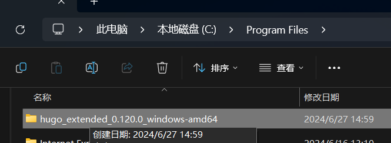
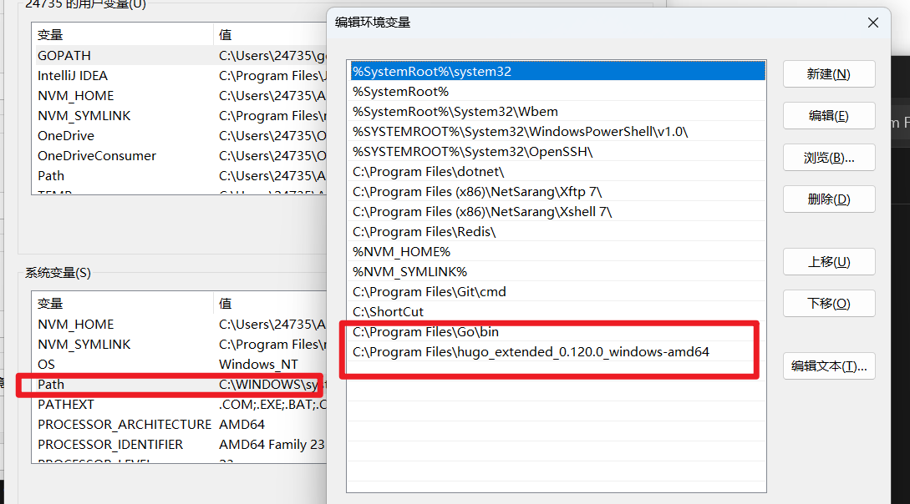
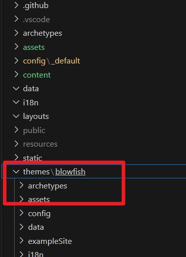
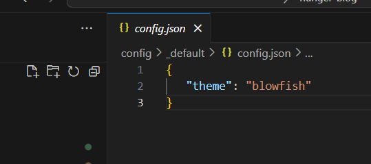
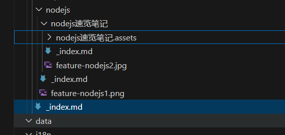
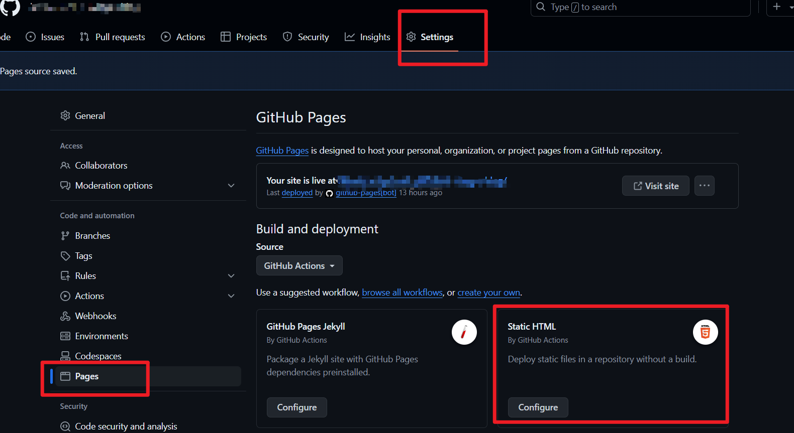
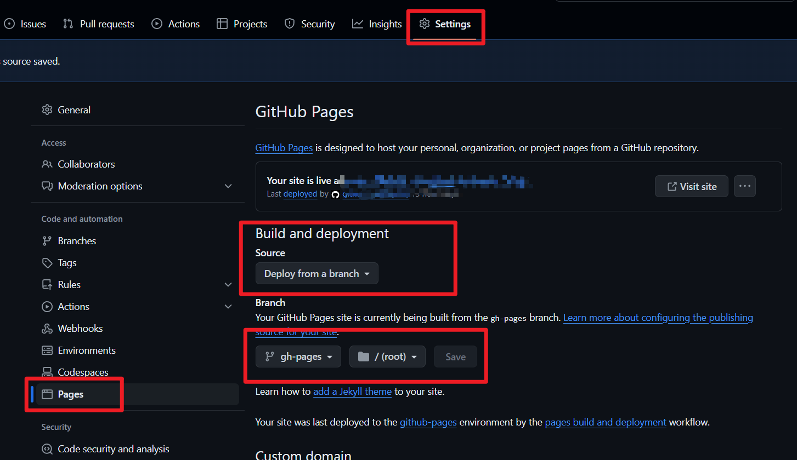

+++
title = 'Hugo 搭建静态博客站过程记录'
date = 2024-07-07T11:15:26+08:00
draft = false

+++

刷博客一时心血来潮，也想要搞一个自己的博客。

但说起来这又不是第一次冒出来这种想法，毕竟程序员想搞个博客是再正常不过的事了吧，学生时代在VPS上搭过一个CMS，奈何当时实在没什么想输出的，加之CMS这种东西对我这种只求简单记录的需求来说确实有些“重”了。

这次刷到的[Hugo](https://hugo.opendocs.io/)就比较合适了（当然还有其他静态站生成框架），可以直接用本地写的markdown文档拖进去就能生成HTML网页。

除此还有相当多的现成的[主题](https://themes.gohugo.io/)可供引入设置，对我来说暂时是够用了。

废话不多嗦！

1. 安装Go语言环境

   没什么细说的，下载[Go](https://go.dev/dl/)安装包，配置环境变量

2. 安装Hugo

   [下载](https://github.com/gohugoio/hugo)一个中意的版本，解压缩到目标安装目录，之后配置其环境变量

   

   

   执行

   ~~~bash
   hugo new site quickstart
   ~~~

   生成基本的项目结构

3. 导入主题

   至于主题的话，最简单的就是 直接打包下载 /子模块克隆 总之放到主题目录就好，并在配置中指定改主题，关于配置的参数解释和意义可以双边参考[Hugo本身文档](https://gohugo.io/documentation/)和所使用主题的文档

4. 新建markdown文件

   关于md文件和其结构，记得每个分类目录下有个 _index.md 文件标志分类页标题

   本地写的md何其资源最好是直接事先封在统一文件夹下，资源用相对路径，方便直接拖入

   

5. Github Page 部署

   关于Github Page部署，之前没接触过，首先设置“动作”点进去就会在你的项目新commit一个配置文件，我的如下

   ~~~json
   # .github/workflows/gh-pages.yml
   
   name: GitHub Page
   
   on:
     push:
       branches:
         - main
   
   jobs:
     build-deploy:
       runs-on: ubuntu-latest
       concurrency:
         group: ${{ github.workflow }}-${{ github.ref }}
       steps:
         - name: Checkout
           uses: actions/checkout@v3
           with:
             submodules: true
             fetch-depth: 0
   
         - name: Setup Hugo
           uses: peaceiris/actions-hugo@v2
           with:
             hugo-version: "0.120.0"
             extended: true
   
         - name: Set up Node.js
           uses: actions/setup-node@v3
           with:
             node-version: '22.3.0'
   
         - name: Build
           run: hugo --minify
   
         - name: Deploy
           uses: peaceiris/actions-gh-pages@v3
           if: ${{ github.ref == 'refs/heads/main' }}
           with:
             github_token: ${{ secrets.GITHUB_TOKEN }}
             publish_branch: gh-pages
             publish_dir: ./public
   
   ~~~

   主要的来看，就是“on”来监听main分支的提交动作，“job”依次部署Ubuntu、Hugo、Node.js，之后调用hugo生成静态网页文件；

   最后的“Deploy”其实只是把“./public”生成的静态文件推到“gh-pages”分支。

   之后把上述分支配成被部署的来源就好了，这样就完成了每次提交main代码自动化部署。

***写的很简陋，是自己写博客的一小步，却是迈出了输出意识的一大步！***
